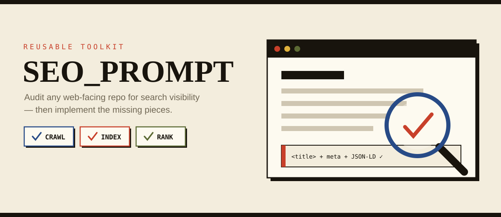
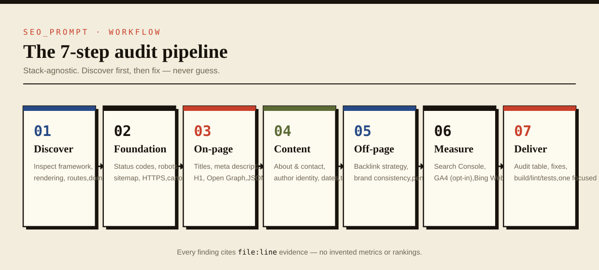
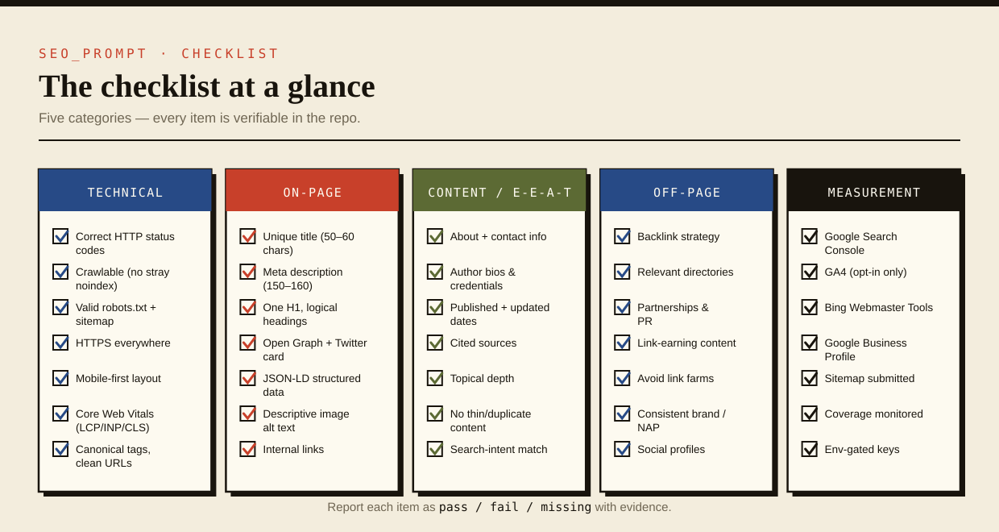
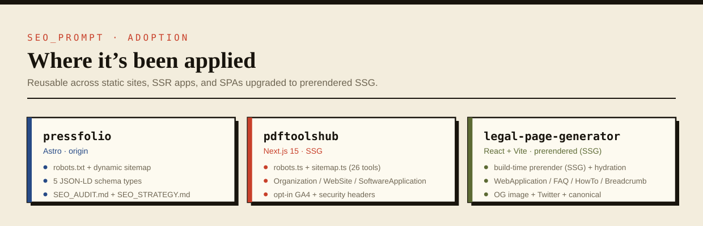

# 🔍 SEO_PROMPT

<p align="center">
  
</p>

<p align="center">
  <em>A reusable <strong>SEO / search-visibility prompt</strong> and an <strong>OpenHands skill</strong> you can drop
  into any web-facing GitHub repository. It turns “make my site rank on Google” into a concrete,
  repeatable workflow: discover the stack, audit against a checklist, implement the fixes, and open a PR.</em>
</p>

<p align="center">
  
  
  
</p>

---

<p align="center">
  <a href="#-whats-inside">What’s inside</a> ·
  <a href="#-the-7-step-workflow">Workflow</a> ·
  <a href="#-the-checklist-at-a-glance">Checklist</a> ·
  <a href="#-how-to-use-it">How to use it</a> ·
  <a href="#-where-its-been-applied">Adoption</a> ·
  <a href="#-placeholders">Placeholders</a> ·
  <a href="#-notes--safeguards">Safeguards</a> ·
  <a href="#-license">License</a>
</p>

---

## 📦 What’s inside

| Path | Purpose |
|---|---|
| [`SEO_PROMPT.md`](SEO_PROMPT.md) | Copy-paste prompt (full version + one-liner) for any AI agent — OpenHands, Copilot, Cursor, etc. |
| [`.agents/skills/seo-audit/SKILL.md`](.agents/skills/seo-audit/SKILL.md) | OpenHands skill that auto-loads on SEO requests so the agent runs the same audit in any repo. |
| `assets/` | README infographics (SVG) — workflow, checklist, adoption. |

## 🔄 The 7-step workflow

<p align="center">
  
</p>

1. **Project discovery** — stack, rendering mode (SSG/SSR/CSR), routes, build commands, base URL, existing SEO assets. No guessing.
2. **Technical foundation** — status codes, crawlability, `robots.txt`, `sitemap.xml`, HTTPS, mobile-first, Core Web Vitals, canonicals, clean URLs, `hreflang`.
3. **On-page SEO** — titles, meta descriptions, headings, Open Graph / Twitter cards, JSON-LD structured data, image alt text, internal links.
4. **Content & E-E-A-T** — about/contact, author identity, dates, sources, topical depth.
5. **Off-page / authority** — backlink strategy, penalty risks, brand consistency.
6. **Accounts & measurement** — Google Search Console, GA4, Bing Webmaster Tools, Google Business Profile.
7. **Deliverables** — audit table with `file:line` evidence, direct implementation, verification, one focused PR.

## ✅ The checklist at a glance

<p align="center">
  
</p>

Every item is verifiable in the repo. The audit reports each one as **pass**, **fail**, or
**missing**, with the file and line that proves it.

## 🚀 How to use it

### Option A — as a prompt
Copy the block between the `PROMPT (copy from here)` / `PROMPT (copy to here)` markers in
[`SEO_PROMPT.md`](SEO_PROMPT.md) and paste it into your agent inside the target repo.

### Option B — as an OpenHands skill
Copy the skill folder into your repo:

```bash
cp -r .agents/skills/seo-audit <target-repo>/.agents/skills/
```

Then tell the agent:

> Run the seo-audit skill on this repo.

## 🌍 Where it’s been applied

<p align="center">
  
</p>

| Project | Stack | What shipped |
|---------|-------|--------------|
| [**PressFolio**](https://github.com/NSKWeb/pressfolio) | Astro · origin | `robots.txt` + dynamic `sitemap.xml`, 5 JSON-LD schema types, `SEO_AUDIT.md` + `SEO_STRATEGY.md` |
| [**pdftoolshub**](https://github.com/NSKWeb/pdftoolshub) | Next.js 15 · SSG | `robots.ts` + `sitemap.ts` for 26 tools, Organization/WebSite/SoftwareApplication JSON-LD, opt-in GA4, security headers |
| [**legal-page-generator**](https://github.com/NSKWeb/legal-page-generator) | React + Vite · prerendered (SSG) | Build-time prerender (`entry-server.jsx` + `prerender.mjs`) with client hydration, real 1200×630 `og-image.png`, `robots.txt` + `sitemap.xml`, WebApplication/FAQPage/HowTo/BreadcrumbList JSON-LD, Open Graph + Twitter + canonical |

## 🔣 Placeholders

| Placeholder | Meaning | Example |
|---|---|---|
| `<BASE_URL>` | Canonical production domain | `https://example.com` |
| `<STACK>` | Framework, if you want to force it | `Next.js 14 App Router` |
| `<GOAL>` | Primary business goal | `rank for "invoice software"` |
| `<LOCALE>` | Language/region targeting | `en-US`, `en-US + es-ES` |

## 🛡️ Notes & safeguards

- It flags **SPA/CSR-only apps** as an SEO risk and recommends SSR/SSG/prerendering, because
  Google may not reliably see client-rendered content.
- It never invents metrics, rankings, or backlinks.
- It asks before deploying, changing the production domain, or adding data-leaking analytics.

## 🤝 Contributing

Improvements are welcome — new checklist items, stack-specific notes, or clearer wording.
Fork the repo, create a branch, and open a Pull Request.

## 📄 License

Released under the [MIT License](LICENSE) — use it, fork it, adapt it to your stack. © NSKWeb

---

<p align="center">
  <sub>Built with 🔍 by <a href="https://github.com/NSKWeb">NSKWeb</a></sub><br/>
  <sub>If this toolkit helped your site get found, please ⭐ the repo!</sub>
</p>
